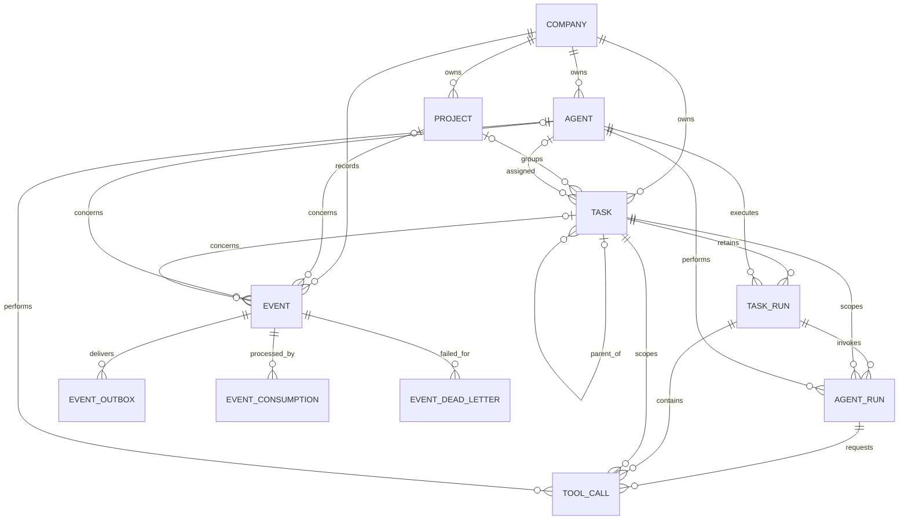

# Persistent domain model

All primary domain IDs are UUIDv4 values. All timestamps are timezone-aware PostgreSQL `timestamptz` values and serialize as ISO 8601 through Pydantic.

## Entities

- **Company** requires a non-empty name, unique normalized slug, and non-empty goal. Its ID is protected from updates by a database trigger.
- **Project** belongs to exactly one company.
- **Agent** belongs to exactly one company. Role is flexible text; configuration is JSONB. Its
  permission JSONB is strictly validated and enforced for every ToolCall.
- **Task** belongs to exactly one company. Project, assigned agent, and parent task are optional. Services ensure any referenced project, agent, or parent belongs to the same company. Iterations are non-negative and maximum iterations are positive.
- **TaskRun** belongs to exactly one task and one agent. Runs are appendable history, so retrying never overwrites an earlier run.
- **AgentRun** belongs to one TaskRun, Task, and Agent. It retains provider/model metadata, lifecycle status, structured response/error data, token usage, estimated cost, and timestamps. A partial unique index permits only one running AgentRun per TaskRun.
- **ToolCall** belongs to one AgentRun, TaskRun, Task, and Agent. It retains typed arguments,
  structured result/error, required permission, lifecycle status, and timestamps. Its state is
  append-only execution history; a row-lock claim prevents concurrent duplicate execution.
- **Event** may reference a company, project, agent, and task. System events may have no company. Its type and topic are flexible text; version, source, correlation, causation, and metadata form the persistent envelope source.
- **EventOutbox** is a delivery attempt for one event. Replay creates another linked outbox row without creating another domain event.
- **EventConsumption** records the state and attempt count for one `(event, consumer)` idempotency identity.
- **EventDeadLetter** persists an exhausted consumer failure in addition to the Redis DLQ entry.

Task `project_id`, `assigned_agent_id`, and `parent_task_id` may be null. Event contextual and causation IDs may be null; its correlation ID is required. All other relationship keys are required.

## Transactional events

Company, project, agent, and task creation write their corresponding `*_CREATED` event and outbox row in the same database commit. Status updates and task transitions do the same. Redis Streams distributes committed envelopes to proof consumers, but consumers have no autonomous behavior. See [event-system.md](event-system.md).

Task lifecycle fields are controlled by the Phase 03 state machine. Each execution attempt has one retained TaskRun; see [task-state-machine.md](task-state-machine.md).

Phase 05 AgentRuns are controlled by the explicit runtime. Model providers cannot write these entities or transition Tasks directly; see [agent-runtime.md](agent-runtime.md).

Phase 06 ToolCalls are controlled by Forge's registry, permission engine, and executor. Models
cannot create side effects directly; see [tool-system.md](tool-system.md).

## Retention

All foreign keys restrict deletion, and the API exposes no DELETE endpoint. Forge uses lifecycle status values for archival and completion so projects, runs, and events remain attributable.
