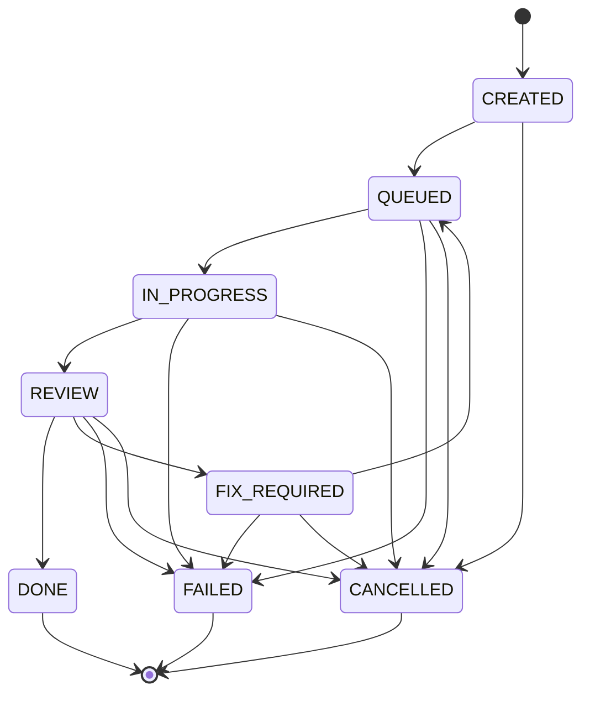

# Phase 03 task state machine

Task status is lifecycle-controlled. `PATCH /api/v1/tasks/{task_id}` edits descriptive and
assignment fields, while `POST /api/v1/tasks/{task_id}/transition` is the only HTTP path that
changes status, iteration, `started_at`, or `completed_at`.



`DONE`, `FAILED`, and `CANCELLED` are terminal and cannot reopen in Phase 03. Invalid transitions
return HTTP 409 with `INVALID_TASK_TRANSITION`. Starting execution without an assignee returns 409
with `TASK_UNASSIGNED`.

## Iterations and timestamps

Tasks start at iteration zero. Each successful `QUEUED → IN_PROGRESS` transition increments the
iteration once and creates exactly one `STARTED` TaskRun. The first execution sets `started_at`;
retries retain that original timestamp. Terminal transitions set `completed_at`, while all
non-terminal states keep it null.

Before execution, the state machine checks `iteration < max_iterations`. At the limit, it atomically
changes the task from `QUEUED` to `FAILED`, creates `TASK_STATUS_CHANGED` and
`TASK_MAX_ITERATIONS_EXCEEDED` events, and creates no new TaskRun. The transition endpoint returns
the resulting failed task.

## TaskRun semantics

`IN_PROGRESS → REVIEW` closes the active run as `SUCCEEDED`; this means execution produced a result,
not that review accepted the Task. `IN_PROGRESS → FAILED` closes it as `FAILED` and retains the
transition reason as structured error data. Cancelling an in-progress Task closes its active run as
`CANCELLED`. Run history is retained and returned in iteration order by
`GET /api/v1/tasks/{task_id}/runs`.

Database constraints require positive run iterations, unique `(task_id, iteration)` pairs, and
completion timestamps that match run status. A partial unique index on `task_runs(task_id)` where
status is `STARTED` prevents multiple active runs even if application validation regresses.

## Atomicity and concurrency

Every transition uses `SELECT ... FOR UPDATE` on the Task row. Concurrent transitions for the same
Task serialize at that lock; after the first commit, the next request validates the newly committed
status. The lock is held only while local database work runs—there are no external calls inside the
transaction. Status, iteration, timestamps, TaskRun changes, and all events commit together or roll
back together.

The Phase 03 migration closes any manually-created Phase 02 active runs and normalizes legacy
`IN_PROGRESS` Tasks back to `QUEUED`, recording a transition event. This avoids inventing execution
history and ensures the next attempt begins through the state machine.

## Transition events

Every accepted lifecycle change writes `TASK_STATUS_CHANGED` with `from_status`, `to_status`,
`reason`, and `iteration`. Execution boundaries additionally write `TASK_RUN_STARTED`,
`TASK_RUN_SUCCEEDED`, or `TASK_RUN_FAILED`; cancellation and limit exhaustion write
`TASK_CANCELLED` and `TASK_MAX_ITERATIONS_EXCEEDED` respectively.

Example lifecycle:

```http
POST /api/v1/tasks/{task_id}/transition
Content-Type: application/json

{"target_status":"QUEUED","reason":"Ready for execution"}
```

Continue with `IN_PROGRESS`, `REVIEW`, and either `DONE` or `FIX_REQUIRED`. A fix follows
`FIX_REQUIRED → QUEUED → IN_PROGRESS`, which starts the next execution iteration.
